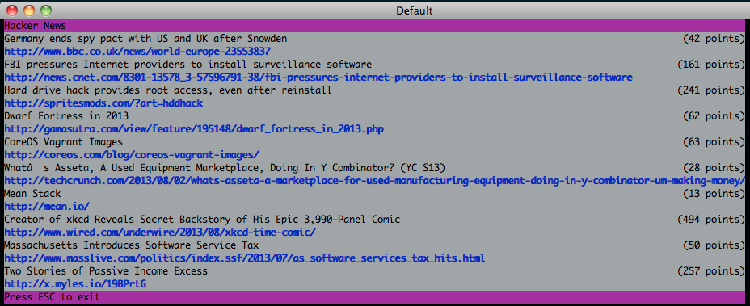

gohn AN AMAZING PROJECT
====

gohn &mdash; Hacker News in the terminal, written in Go. Inspired by [this](http://andrewvos.com/2013/08/02/hacker-news-in-the-terminal/)

## Install

~~~text
go install github.com/gedex/gohn
~~~

## Usage

~~~text
$ gohn
~~~

## License

This library is distributed under the BSD-style license found in the LICENSE.md file.
